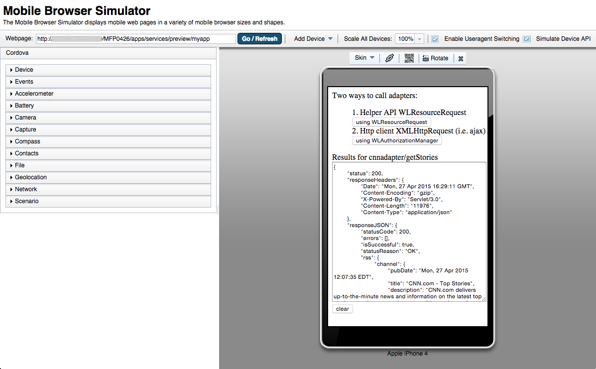
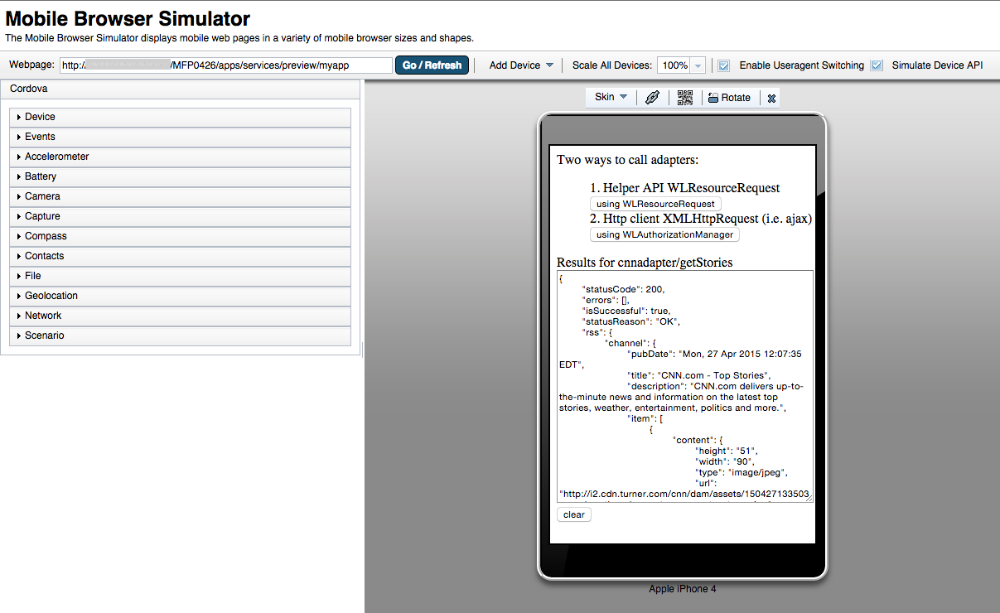

##Adapter Calling Sample for MobileFirst Platform Foundation (MFP)

This sample shows two ways to call an adapter from a MFP hybrid app

### Two ways to call adapters or any oAuth protected custom URI resource:

- Using Helper API WLResourceRequest helper API
- Using straight http client XMLHttpRequest (i.e. ajax)


### Install

- Download the sample app

```javascript
$ git clone https://github.com/csantanapr/mfp-adapters-ajax.git
````


### How to use

- Download and Install the [MobileFirst Platform Foundation (MFP) CLI](https://developer.ibm.com/mobilefirstplatform/install/#clui)


- Create and Start MFP Project using CLI

```javascript
$ mfp create mfproject
$ cd mfproject
$ mfp start
````

- Create Hybrid App with environments for iOS and Android

```javascript
$ mfp add hybrid coolApp
$ mfp add environment iphone
$ mfp add environment android
````

- Replace contents of common directory with content from this repository

```javascript
$ rm -r apps/coolApp/common/*
$ cp -r ~/mfp-adapters/* apps/coolApp/
```

- Add an Adapter using MFP CLI

```javascript
$ mfp adapter add cnnadapter --type http
```

- (Optional) Review Adapter name and procedure to call in js/main.js

```javascript
var adapterName = 'cnnadapter';
var adapterProcedure = 'getStories';
```

- Build, Deploy and Preview Adapter and App

```javascript
$ mfp bd
$ cd apps/coolApp
$ mfp preview
```

### Customizations
- By default the sample calls an adapter with name cnnadpater and procedure getStories not parameters using a HTTP GET
- JavaScript Adapters can be only call with GET and POST, For hybrid Apps oAuth adapter calling is supported on evironments iphone, ipad, android, Windows Phone 8, and Windows 8 in MFP 7.0
- Java based adapters using JXRS support more HTTP verbs, check the MFP documentation for more details

### Demo



### More Information
- Check the [MFP Getting Started](https://developer.ibm.com/mobilefirstplatform/documentation/getting-started/)
- Check the [MFP Docs](http://www-01.ibm.com/support/knowledgecenter/SSNJXP/welcome.html)
- Check the Doc section [Client access to adapters](http://www-01.ibm.com/support/knowledgecenter/SSHS8R_7.0.0/com.ibm.worklight.dev.doc/devref/c_client_access_to_adap.html)
- Check the Doc section [Custom requests to resources using JavaScript](http://www-01.ibm.com/support/knowledgecenter/SSHS8R_7.0.0/com.ibm.worklight.dev.doc/dev/c_custom_request_to_resource_hybrid.html)
-

### License
Apache 2.0
